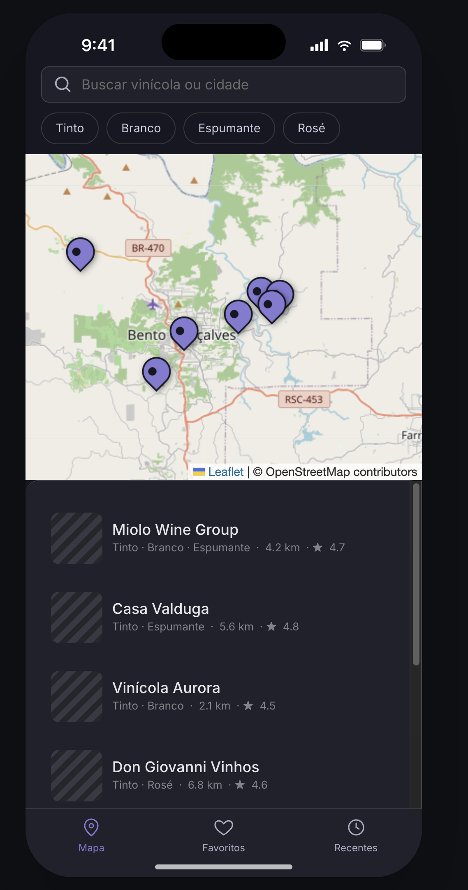
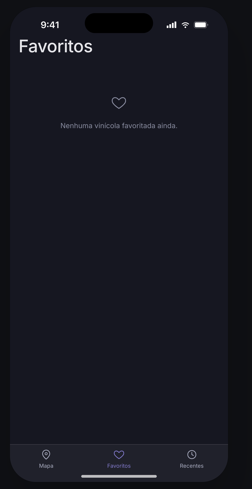
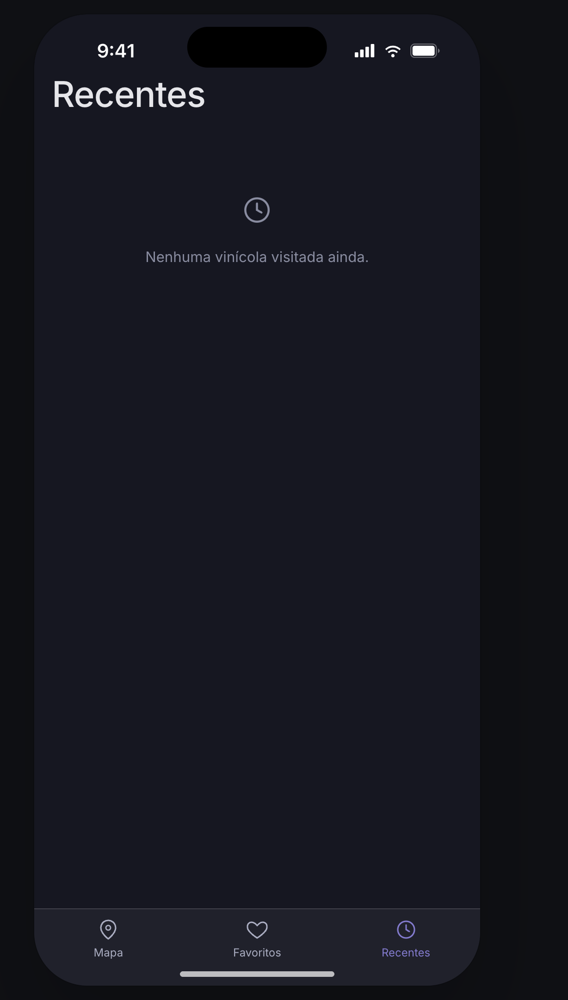

# Winery Finder

App para encontrar, conhecer e traçar rota até vinícolas próximas — protótipo de UX/UI feito no Claude Design, base para a implementação em Flutter + Firebase.

Projeto desenvolvido como parte de uma dinâmica de Design Thinking: imersão, personas, canvas do produto e prototipação.

## Telas do protótipo

| Mapa | Favoritos | Recentes |
|---|---|---|
|  |  |  |

- **Mapa** — busca por vinícola/cidade, filtros por tipo de vinho (Tinto, Branco, Espumante, Rosé) e lista de vinícolas próximas com distância e avaliação, sincronizada com os pins no mapa.
- **Favoritos** — vinícolas salvas pelo usuário para visitar depois (estado vazio ilustrado acima).
- **Recentes** — histórico das vinícolas já visitadas no app (estado vazio ilustrado acima).

Cada vinícola tem uma tela de detalhe (fotos, horário, preço de degustação, avaliações, contato/site) e um fluxo de rota/navegação via GPS até o local.

## Stack

| Camada | Tecnologia |
|---|---|
| Design / protótipo | Figma (evoluído a partir do protótipo em Claude Design deste repositório) |
| App | Flutter (iOS + Android) |
| Backend | Firebase — **Firestore** para o CRUD de vinícola (cadastro de detalhes e localização, listagem) e **Storage** para fotos |
| Estado local | Favoritos e recentes ficam no estado do app (não são uma coleção do Firebase nesta versão) |

O cadastro de vinícolas (CRUD) é administrado pela equipe — não existe tela de "adicionar vinícola" para o usuário final do app.

## Design Thinking

Documentação da imersão, personas, mapas de empatia, storytelling e canvas do produto:

- [`design-thinking/personas-e-canvas.md`](design-thinking/personas-e-canvas.md) — relatório completo (público-alvo, personas, problema, funcionalidades, desafios).
- [`design-thinking/canvas-board.html`](design-thinking/canvas-board.html) — canvas do projeto em formato de board (participantes, problema, usuários, atividades, entregas, riscos, milestones, restrições e escopo).

## Estrutura do repositório

```
Winery Finder.dc.html   Protótipo (Claude Design) — abre com support.js
ios-frame.jsx           Componente de moldura do dispositivo usado no protótipo
winery-map.html         Mapa (Leaflet) embutido no protótipo
nocturne-styles.css     Tema visual do protótipo
_ds/                    Assets do design system gerado pelo Claude Design
docs/screenshots/       Capturas de tela do protótipo (usadas neste README)
design-thinking/        Relatório de personas, mapas de empatia e canvas do projeto
```

## Histórico de mudanças

- Protótipo inicial do app (mapa, detalhe da vinícola, rota, favoritos, recentes).
- Relatório de Design Thinking: público-alvo, personas (Camila, Eduardo, grupo de amigas), mapas de empatia, storytelling e problema.
- Canvas do projeto em formato de board, no padrão usado no Miro da equipe.
- Definição da stack técnica (Figma + Flutter + Firebase) refletida no relatório e no canvas.
- Ajuste dos participantes do canvas (PO, UX, Tech Lead, Pesquisa & marketing).
